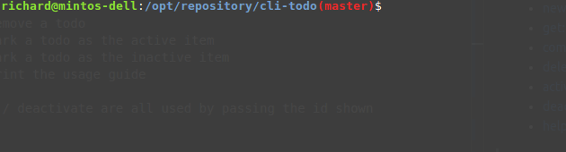

# Basic Todo for your terminal
A very simple todo that runs within your terminal,   
Once you activate a task you'll receive an OS notification 20 minutes after.

# How to Install
#### npm
run: `npm install -g @richardroy/cli-todo`  
Then you can access it via: `todo <commands>`

It has the following available commands:

    todo <command>

    - new:        used to create a new todo
          press enter to write the title of your todo item
    - get:        used to retrieve your todos
          white, incomplete
          green, completed
          yellow, active
    - complete:   used to mark a todo as complete. Will also deactivate active tasks
          can pass in the todo number, will complete that item
    - delete:     used to remove a todo
          can pass in the todo number, will delete a single todo item
          can pass in 'completed', will delete all of the completed todo items
          can pass in 'all', will delete all todo's in the list
    - activate:   used to mark a todo as the active item
          can pass in the todo number, will activate that item
    - deactivate: used to mark a todo as an inactive item
          can pass in the todo number, will deactivate that item
    - help:       used to print the usage guide

### Running Locally
Change into project dir then run: `npm install`  
Trigger the todo via: `./bin/todo <commands>`

### Running Tests
`npm run test`

Resources used:  
https://scotch.io/tutorials/building-cli-applications-with-nodejs